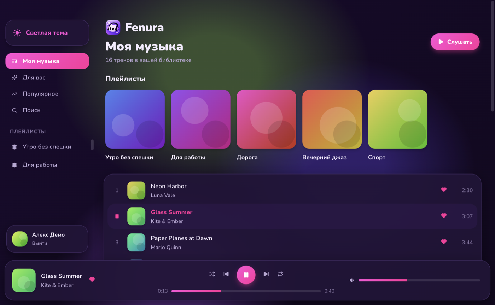
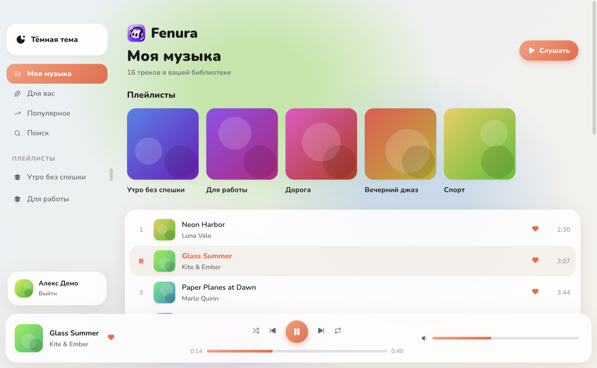
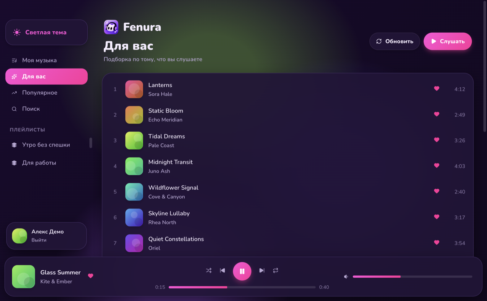

<div align="center">


# Fenura

**Музыкальный плеер для ВКонтакте на macOS и Windows**

Ваша музыка, плейлисты, поиск и рекомендации в одном красивом окне.<br>
Без рекламы в интерфейсе, без лишнего, с быстрым стартом и плавной анимацией.

[](https://github.com/pxdxx/Fenura-vk-music-win-macos/releases/latest)
[](LICENSE)
[](#скачать)
[](https://github.com/pxdxx/Fenura-vk-music-win-macos/actions/workflows/build.yml)

[Скачать](#скачать) · [Возможности](#возможности) · [Сборка из исходников](#сборка-из-исходников) · [Ограничения](#ограничения)

</div>

<p align="center">
  
</p>

<p align="center">
  
  
</p>

<sub>На скриншотах демо-режим с вымышленными треками.</sub>

## Возможности

- **Вход через страницу ВКонтакте.** Пароль, двухфакторная защита, QR-код и капча обрабатываются самим сайтом в отдельном окне. Пароль приложение не видит и не хранит.
- **Моя музыка.** Вся библиотека сразу при запуске. Последняя версия списка показывается мгновенно, пока идёт обновление.
- **Плейлисты.** В боковой панели и в виде ленты обложек на главной.
- **Поиск** треков и плейлистов, результаты появляются по мере ввода.
- **Для вас и Популярное.** Рекомендации с кнопкой обновления и чарты.
- **Плеер.** Очередь, перемешивание, повтор списка и одного трека, перемотка, громкость.
- **Лайки.** Добавляйте и убирайте треки из своей музыки в один клик, в том числе из контекстного меню.
- **Системные медиа-клавиши и Now Playing.** Управление из Control Center на macOS и из панели громкости Windows.
- **Две темы.** Тёмная и светлая, переключаются кнопкой или `Ctrl+Shift+T` (`⌘⇧T` на Mac).
- **Цвет от обложки.** Фон подстраивается под играющий трек.
- **Автовосстановление.** Если ссылка на трек устарела или поток оборвался, плеер сам берёт свежую и продолжает с того же места.
- **Безопасное хранение сессии.** Токен лежит в связке ключей macOS и в защищённом хранилище Windows (DPAPI).

### Горячие клавиши

| Действие | Windows | macOS |
| --- | --- | --- |
| Играть / пауза | `Пробел` | `Пробел` |
| Следующий трек | `Ctrl` + `→` | `⌘` + `→` |
| Предыдущий трек | `Ctrl` + `←` | `⌘` + `←` |
| Сменить тему | `Ctrl` + `Shift` + `T` | `⌘` + `⇧` + `T` |

## Скачать

Готовые сборки лежат на странице [Releases](https://github.com/pxdxx/Fenura-vk-music-win-macos/releases/latest).

| Система | Файл |
| --- | --- |
| macOS 14 и новее, Apple Silicon и Intel | `Fenura-<версия>-macOS.dmg` |
| Windows 10 и 11, 64 бита | `Fenura-Setup-<версия>.exe` |

### macOS

1. Откройте `.dmg` и перетащите Fenura в папку «Программы».
2. Приложение не заверено у Apple (у проекта нет платной подписки разработчика), поэтому при первом запуске macOS может показать предупреждение. Нажмите «Готово», затем откройте **Системные настройки, Конфиденциальность и безопасность** и нажмите **«Всё равно открыть»** рядом с Fenura.
3. Если система пишет, что приложение повреждено, выполните в Терминале:

```bash
xattr -cr /Applications/Fenura.app
```

### Windows

1. Запустите `Fenura-Setup-<версия>.exe`, выберите папку установки и дождитесь окончания. Ярлыки появятся на рабочем столе и в меню «Пуск».
2. Установщик не подписан цифровой подписью, поэтому SmartScreen может показать окно «Система Windows защитила ваш компьютер». Нажмите **«Подробнее»**, затем **«Выполнить в любом случае»**.
3. При первом запуске откроется окно входа ВКонтакте. Войдите как обычно, и библиотека загрузится сама.

## Как это устроено

Проект состоит из двух независимых приложений с общим дизайном и одинаковым набором функций.

| | macOS | Windows |
| --- | --- | --- |
| Интерфейс | SwiftUI | Electron, HTML и CSS |
| Воспроизведение | AVPlayer | `<audio>` и hls.js |
| Now Playing | MPNowPlayingInfoCenter | Media Session API (SMTC) |
| Хранение токена | Keychain | DPAPI через Electron safeStorage |
| Вход | WKWebView | BrowserWindow с общей сессией |

Музыка загружается через тот же неофициальный аудио-API, что использует сайт ВКонтакте. Если один из способов не сработал, приложение параллельно пробует другие (официальные методы, каталог и сама веб-страница) и берёт первый ответ.

```
.
├── Fenura/              исходники приложения для macOS (SwiftUI)
├── Fenura.xcodeproj
├── scripts/             сборка и генерация иконки для macOS
├── windows/             приложение для Windows (Electron)
│   ├── src/main/        VK API, вход, хранение сессии
│   ├── src/renderer/    интерфейс и плеер
│   └── test/            тесты разбора ответов VK
└── .github/workflows/   сборка .dmg и .exe в GitHub Actions
```

## Сборка из исходников

### macOS

Нужны macOS 14+ и Xcode.

```bash
open Fenura.xcodeproj
```

Или из терминала:

```bash
./scripts/build.sh
open dist/Fenura.app
```

Сборку лучше не держать в iCloud Documents: из-за расширенных атрибутов File Provider подпись приложения падает. Скрипт собирает в `/tmp` и копирует готовый `.app` в `dist/`.

### Windows

Нужен [Node.js](https://nodejs.org/) 22 и новее.

```bash
cd windows
npm install
npm start          # запуск
npm run demo       # запуск без ВКонтакте, с вымышленными треками
npm test           # тесты
npm run dist       # установщик в windows/dist
```

Установщик `.exe` собирается на Windows. Сборку и проверку на настоящей Windows выполняет [GitHub Actions](.github/workflows/build.yml): он прогоняет тесты, собирает установщик, устанавливает его и запускает приложение в демо-режиме со сценарием проверки (воспроизведение, пауза, перемотка, поиск, темы и другое). Скриншоты этой проверки сохраняются как артефакт запуска.

## Ограничения

- Fenura это **плеер, а не загрузчик**. Треки только воспроизводятся потоком.
- Это **неофициальный клиент**, он не связан с ВКонтакте и не одобрен этой компанией. Метод получения музыки может измениться на стороне сервиса, тогда потребуется обновление.
- Токен и куки хранятся только на вашем компьютере. Выход из аккаунта в приложении удаляет их.
- Сборки не имеют цифровой подписи, поэтому ОС показывает предупреждения при первом запуске (см. выше).

## Участие

Замечания и пулреквесты приветствуются. Если что-то не работает, откройте [issue](https://github.com/pxdxx/Fenura-vk-music-win-macos/issues) и опишите систему, версию Fenura и что именно произошло.

## Связь

Telegram - [@pxdxz](https://t.me/pxdxz)
Youtube - [Tractor](https://www.youtube.com/@pxdxxz)
Email - rasputikovv@gmail.com

## Лицензия

[MIT](LICENSE) © 2026 pxdxx
